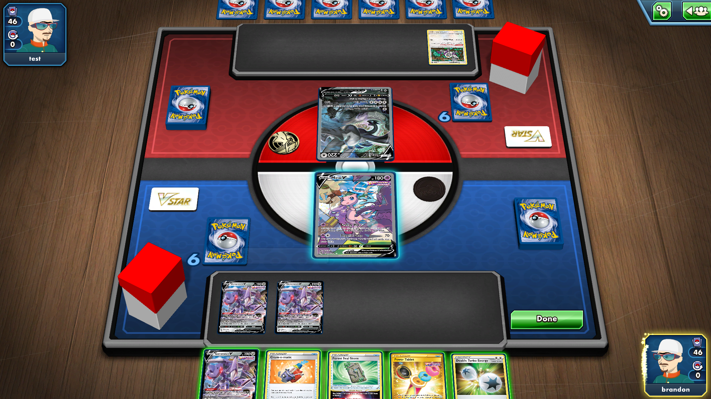
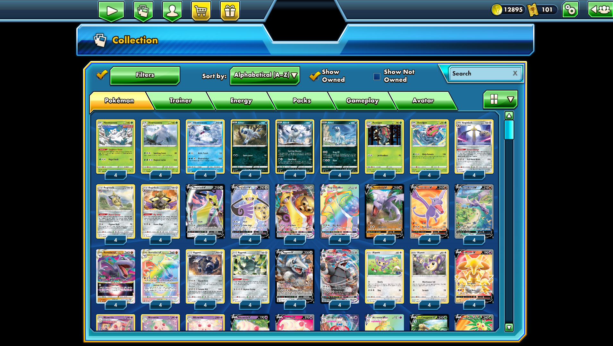
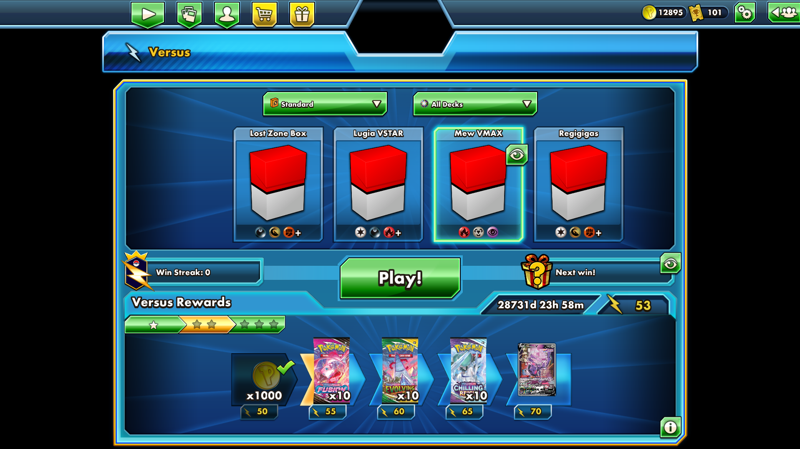

# SpiritPTCGO
SpiritPTCGO is a Python server emulator for the **NOW** sunseted [Pokemon Trading Card Game Online (PTCGO)](https://en.wikipedia.org/wiki/Pok%C3%A9mon_TCG_Online) client.

## Prequisites & Warning
- This server was developed using the 2023 client (**2.95.0.5815**)
  - Do note that if your copy of the client is not that version, there MAY be in incompatibility issues.

- Make sure you own a copy of the PTCGO client beforehand for this server to run with!

## Gallery
### In Game


### Collection


## Versus



## Environment Setup

**WARNING**: These instructions are meant for a Windows 11 Machine and have only been tested on Windows.
1. Clone the repository
2. Install [Python 3.10+](https://www.python.org/downloads/)
   - It is important to ``Add to PATH`` when you are installing Python. (You can check by running this command in your terminal ``python --v``)
3. Navigate to the project in a terminal and generate a python venv via: ``python -m venv venv``
4. Activate your venv by running this command in the same terminal: ``./venv/Scripts/activate``
5. Now run the command: ``pip install -r requirements.txt``

## Server Setup

1. Navigate to your PTCGO installation folder and find the `Pokemon Trading Card Game Online_Data\cake.cfg` file. 
   Edit the file to point the `hostname`, `versionURL`, and `assetURL` to your local machine:
   ```ini
   hostname=127.0.0.1
   versionURL=http://127.0.0.1:8000/
   assetURL=http://127.0.0.1:8000/
   ```
   *(Leave the AppSecrets and version string at the bottom)*

2. Generate the SSL Certificates
   ```powershell
   python spirit/network/generate_cert.py
   ```
   **DO NOT** install this certificate into your Windows Trusted Root Store. If the certificate is trusted by Windows, the game's validator will actually reject it due to a Unity hostname parsing bug with IP addresses. As long as the `.crt` and `.key` files are next to the server script, the Python server will use them, and the client will accept them.

3. Run the database initialization script to create the local SQLite database (`ptcgo_server.db`) using SQLAlchemy ORM and seed the default test account (Username: `brandon` / Password: `password`):
   ```powershell
   python spirit/database/setup_db.py
   ```

4. Run the main Python script from the root directory to start both the TCP (Game) and HTTP (Asset/MOTD) servers:
   ```powershell
   $env:PYTHONPATH=(Get-Location).Path; python -m spirit.main
   ```
   Do note that on the first initial run, the server will download any initial asset bundles it needs determined by the ``game/scripts/`` and ``assets/cards/`` directories (more info on card injections below)

5. **(Optional)** If you have original game cache files (like UI elements, logos, etc.) that you want the server to serve:
   - You can copy them into `spirit/assets/externalCache/`.
   - OR set the `PTCGO_CACHE_DIR` environment variable to point to your original game cache folder before running the server.

6. Run the ``Pokemon Trading Card Game Online.exe`` in your client's installation folder and you should be able to see logs in your servers as you login!

### Hosting for Others (Remote Play)

The steps above are all you need for local play on a single machine (the client and server on the same PC). If you want friends to connect over the internet or a LAN, there's one extra knob: `spirit/config.py`.

The reason is that the login handshake redirects the client to a follow-up address mid-connection. Loopback/LAN peers get echoed back whatever address they dialed, so `127.0.0.1` "just works" locally, but a remote client that gets pointed at `127.0.0.1` will silently disconnect before it ever logs in. So for remote hosting you have to tell the server its real public address.

1. On the **server** machine, set `PUBLIC_HOST` to your public IP or domain. Either edit `spirit/config.py`:
   ```python
   PUBLIC_HOST = os.environ.get("SPIRIT_PUBLIC_HOST", "your.public.ip.or.domain")
   ```
   ...or leave the file alone and just export the env var before launching:
   ```powershell
   $env:SPIRIT_PUBLIC_HOST="your.public.ip.or.domain"
   ```
2. Make sure the HTTP port (`8000`) and TCP game port (`39389`) are forwarded/open on your router and firewall.
3. On each **connecting** machine, point that same public address into `cake.cfg` instead of `127.0.0.1`:
   ```ini
   hostname=your.public.ip.or.domain
   versionURL=http://your.public.ip.or.domain:8000/
   assetURL=http://your.public.ip.or.domain:8000/
   ```

> **Hosting on a VPS?** See [`deploy/`](deploy/README.md). For a full DigitalOcean
> Droplet walkthrough (Ubuntu, nginx, systemd, firewall), see
> [`deploy/DIGITALOCEAN.md`](deploy/DIGITALOCEAN.md). Not needed for local
> development — only for reliable remote hosting.

## Custom Card Creation

SpiritPTCGO supports a modular card injection system. You add a custom card by dropping an image and a python script into the designated folders, and the server handles the Unity AssetBundle generation automatically on startup. A card is two things: a **data definition** (its name, HP, cost, weakness, etc.) and, if you want it to actually *do* something in a match, a bit of **scripted behavior**. We'll cover both.

### 1. Place the Card Image
Save your card art as a **1024x1024 PNG** in the following directory:
`spirit/assets/cards/<SET_CODE>/<NAME>_<NUMBER>.png`

Example: `spirit/assets/cards/CUSTOM/LugiaV_1.png`

IMPORTANT: It's important to note that my card bundling script will add padding to images to make them 1024x1024, so using card images from say a popular pokemon tcg api would work ;)

### 2. Create the Card Script
Create a Python script to define the card's data and attributes:
`spirit/game/scripts/cards/<SET_CODE>/<NAME>_<NUMBER>.py`

Example: `spirit/game/scripts/cards/CUSTOM/LugiaV_1.py`

```python
from spirit.game.data_utils import PokemonCardDef, Ability, Attack
from spirit.game.attributes import PokemonTypes, PokemonStage, Rarities, AbilityTypes

# Define the card object
card = PokemonCardDef(
    guid="a1b2c3d4-e5f6-4a5b-8c9d-0e1f2a3b4c5d", # any unique UUID -- run: python -c "import uuid; print(uuid.uuid4())"
    key="CUSTOM", # I typically will leave this as the same as set_code
    name="Lugia V",
    collector_number=1,
    set_code="CUSTOM",
    rarity=Rarities.RareUltra,
    hp=220,
    elements=[PokemonTypes.COLORLESS],
    stage=PokemonStage.BASIC,
    retreat_cost=2,
    family_id=249, # I typically put the pokedex national number
    weakness_type=PokemonTypes.LIGHTNING, # optional; defaults to no weakness
    abilities=[
        Attack(
            title="Aero Ball",
            game_text="This attack does 20 damage for each Energy attached to this Pokémon.",
            cost={PokemonTypes.COLORLESS: 2},
            damage=20,
            damage_operator="x"
        )
    ]
)
```

That is a complete, valid card. If it evolved from something you'd add `evolves_from="Lugia V"` (the literal name it evolves from) and bump the `stage`; a Stage 1 or 2 needs a lower stage of the family already in play to evolve onto.

### 2b. Making Attacks and Abilities Actually Do Something

The block above defines the card, but the client itself does **no** rules logic — the server decides what every attack does. Each `Attack` (and `Ability`) takes an optional `effect=`, and how you set it decides the behavior:

* **Leave `effect` off entirely**: the engine treats it as a *vanilla* attack and just deals the printed `damage` (auto-applying weakness ×2 / resistance −30 against the opponent's Active) and ends the turn. Perfectly fine for plain hitters.
* **`effect=unimplemented`**: the card has real effect text you haven't scripted yet. Base damage still resolves, but the server logs a warning so you know it's a stub. Handy for getting a whole set playable-at-base quickly and coming back later.
* **`effect=<an async function>`**: full scripted behavior. You write an `async def effect(ctx):` coroutine, and `ctx` is your handle on the whole game (see `spirit/game/session/effects.py` for the complete API).

Here's Aero Ball code. The printed text says "20 damage for each Energy attached," so instead of a flat number we count the energy and deal it ourselves:

```python
from spirit.game.data_utils import PokemonCardDef, Attack, unimplemented
from spirit.game.attributes import PokemonTypes, PokemonStage, Rarities

async def aero_ball(ctx):
    attached = ctx.attached_energies(ctx.source)   # every Energy on this Pokémon
    await ctx.deal_damage(20 * len(attached))      # weakness/resistance auto-apply vs the Active

card = PokemonCardDef(
    guid="a1b2c3d4-e5f6-4a5b-8c9d-0e1f2a3b4c5d",
    key="CUSTOM",
    name="Lugia V",
    collector_number=1,
    set_code="CUSTOM",
    rarity=Rarities.RareUltra,
    hp=220,
    elements=[PokemonTypes.COLORLESS],
    stage=PokemonStage.BASIC,
    retreat_cost=2,
    family_id=249,
    abilities=[
        Attack(
            title="Aero Ball",
            game_text="This attack does 20 damage for each Energy attached to this Pokémon.",
            cost={PokemonTypes.COLORLESS: 2},
            effect=aero_ball
        )
    ]
)
```

`ctx` gives you everything you need to express real card text. A few of the common ones:

* `ctx.source` / `ctx.attacker` — the Pokémon using the attack
* `ctx.defender` / `ctx.opponent_active()` — the opponent's Active
* `ctx.deal_damage(amount=None)` — deal damage (printed `damage` if you omit the amount); handles weakness/resistance vs the Active for you
* `ctx.heal(amount, target=None)`
* `ctx.draw_cards(count)`
* `ctx.flip_coins(count, title)` → a list of bools (`True` = heads)
* `ctx.ask_yes_no(prompt)` → bool, and `ctx.choose(prompt, buttons)` → the chosen index
* `ctx.attached_energies(pokemon)`, `ctx.my_bench()`, `ctx.opponent_bench()`, `ctx.discard_stadium()`

The entire API list (searching decks, moving cards between zones, special conditions, passives) is in `effects.py`.

Trainers work the same way. An `ItemCardDef` / `SupporterCardDef` / `StadiumCardDef` takes the same `effect=` coroutine:

```python
from spirit.game.data_utils import ItemCardDef, unimplemented
from spirit.game.attributes import Rarities

async def field_notes(ctx):
    """Draw 2 cards."""
    await ctx.draw_cards(2)

card = ItemCardDef(
    guid="d73ca4da-dd21-f428-8051-264ab564587c",
    key="CUSTOM",
    name="Field Notes",
    collector_number=2,
    set_code="CUSTOM",
    rarity=Rarities.Common,
    effect=field_notes
)
```

A couple of things worth knowing as you go deeper: an `Ability` can be a passive body (`ability_type=AbilityTypes.POKE_BODY` with a `passive=`), a triggered ability (`trigger=Triggers.ON_PLAY`), or an activated one — and both cards and trainers take a `condition=` to gate when they're even offered (Ultra Ball needing two cards to discard, etc.). Read references from an existing card under `spirit/game/scripts/cards/` since the two starter decks are fully scripted.

If you want to see what's already scripted versus stubbed across a set, there's a tool:
```powershell
python -m spirit.tools.effect_coverage
```

### 3. Get the Card Into a Collection
A fresh account only starts with the two starter decks and some booster packs. To give yourself your custom card in for testing, start the server and open the **Admin Dashboard** at `http://127.0.0.1:8000/admin`. Log in with the seeded admin account (`brandon` / `password`), go to the **Accounts** tab, and hit **Grant All Cards** on your account.

### 4. Run the Server
Start the server as usual. On startup, the `AutoBundle` system detects the new script, finds the corresponding PNG, and generates a `.unity3d` AssetBundle automatically in `spirit/assets/`.
```powershell
$env:PYTHONPATH=(Get-Location).Path; python -m spirit.main
```

## Custom Cosmetic Creation

SpiritPTCGO supports an advanced **Dynamic Cosmetic Asset Injection** system. You can add fully custom card sleeves, gameplay coins, and 3D deck boxes by placing your PNG textures in the designated folders. The server will dynamically expand the master asset templates and generate the client-prefixed AssetBundles automatically on startup.

### 1. Place your Custom Textures
Save your custom textures as PNGs under the respective subdirectories inside `spirit/assets/products/`:

* **Sleeves:** Place in `spirit/assets/products/custom_sleeves/`
  * *Recommended Resolution:* **`512x512`** or **`256x256`** pixels (Square `1:1`).
* **Coins:** Place in `spirit/assets/products/custom_coins/`
  * *Recommended Resolution:* **`256x256`** pixels (Square `1:1`). Transparent background outside the circular border is recommended.
* **Deck Boxes:** Place in `spirit/assets/products/custom_deckboxes/`
  * *Recommended Resolution:* **`512x512`** pixels (Square `1:1`). This texture folds directly over the 3D model's UV layout.

*Note: Filenames must be lowercase and use underscores/numbers (e.g., `my_cool_sleeve.png`). The filename (without extension) becomes the logical asset ID. Non-standard dimensions are automatically scaled to the proper size on server boot.*

### 2. Update your Product Definition
To assign your custom cosmetics to players or set them as defaults, use their lowercase filenames as the logical `image_url` property in your product definitions (located inside `spirit/game/scripts/products/`):

Example: In `spirit/game/scripts/products/noset/basic_sleeve.py`
```python
from spirit.game.data_utils import SleeveDef

product = SleeveDef(
    guid="e079c0d3-b934-4fbd-b021-545106c75693", # Client Default Sleeve GUID
    key="NoSet",
    name="Basic Sleeve",
    image_url="my_cool_sleeve" # Points directly to your custom 'my_cool_sleeve.png'!
)
```

### 3. Sync the Database
To apply any updated product properties and synchronize the items to existing players:
```powershell
python spirit/database/seed_collection.py
```

### 4. Run the Server
On boot, the server automatically reads your templates, allocates unique PathIDs, dynamically appends your custom textures to the unified master bundles, and registers them in the asset manifest for the client:
```powershell
$env:PYTHONPATH=(Get-Location).Path; python -m spirit.main
```
Your custom cosmetics are now ready to be equipped and rendered in game!

## Custom Booster Pack & Theme Deck Creation

SpiritPTCGO supports the exact same advanced dynamic appending system for **Booster Packs** and **PCD/Theme Decks**. You can customize the look of pack foils and deck boxes in the Shop and Opening scenes by placing your PNG textures in the designated folders.

### 1. Place your Custom Textures
Save your custom textures as PNGs under the respective subdirectories inside `spirit/assets/products/`:

* **Booster Packs:** Place in `spirit/assets/products/custom_packs/`
  * *Image Specifications (to prevent stretching):* The game client renders booster packs using a square **`512x512`** transparent canvas. To prevent the vertical booster pack art from being stretched horizontally, your image must be laid out on a transparent square canvas as follows:
    * **Canvas Dimensions:** `512x512` pixels (RGBA transparent background).
    * **Booster Art Position:** The visible booster pack artwork should be scaled to a height of **`496`** pixels, with exactly **`16`** pixels of top padding (stretching from Y=16 to Y=512).
    * **Horizontal Alignment:** Center the artwork horizontally. It should have a width of roughly **`270`** to **`285`** pixels (depending on your source artwork's aspect ratio), leaving transparent padding on the left and right.
* **Theme Decks (PCDs):** Place in `spirit/assets/products/custom_pcds/`
  * *Recommended Resolution:* **`512x512`** pixels (Square `1:1`). This texture represents the flat box skin used by the client's PCD renderer.

*Note: Filenames must be lowercase (e.g., `xy_breakthrough_booster.png`). The filename (without extension) becomes the logical asset ID inside the client packs/pcdBoxes bundle.*

### 2. Update your Product Definition
To link your custom booster or deck art to the item, use its lowercase filename as the `image_url` property in your product scripts (located inside `spirit/game/scripts/products/`):

Example: In `spirit/game/scripts/products/xy8/booster_7df512a8.py` (Breakthrough Booster Pack)
```python
from spirit.game.data_utils import BoosterPackDef

product = BoosterPackDef(
    guid="7df512a8-8f81-432d-ae52-9d3df3902341",
    key="xy8",
    name="BREAKthrough Booster Pack",
    image_url="xy_breakthrough_booster" # Points directly to your custom 'xy_breakthrough_booster.png'!
)
```

### 3. Run the Server
On boot, the server reads `packs.template` and `pcdBoxes.template`, dynamically appends your custom textures to the unified master bundles, updates the client-side mappings, and serves them automatically in game!
```powershell
$env:PYTHONPATH=(Get-Location).Path; python -m spirit.main
```

## Custom Versus Season Rewards

SpiritPTCGO features a configuration-driven **Versus Season Reward System** that allows server administrators to easily customize, add, or schedule different seasons and tiers of rewards (Trainer Coins, Booster Packs, Cards, Deck Boxes, Sleeves, etc.) without writing any code.

### 1. Edit the Seasons Configuration
All versus seasons are defined inside the following JSON file:
`spirit/database/json_data/versus_seasons.json`

You can edit this file to modify the active season, update the start/end timestamps, adjust the point thresholds, or add custom rewards.

Example season block:
```json
[
  {
    "seasonID": "Season1",
    "startTime": 0,
    "endTime": 4102444800000,
    "description": {
      "id": "SpiritPTCGO Season 1"
    },
    "tiers": [
      {
        "rewards": {
          "10": [
            {
              "name": "5 Tokens",
              "rewardType": "Tokens",
              "rewardAmount": 5,
              "rewardCurrency": "prizeTrainerCoin"
            }
          ]
        }
      },
      {
        "rewards": {
          "50": [
            {
              "name": "1 Pack",
              "rewardType": "Product",
              "rewardAmount": 1,
              "rewardProductID": "your-booster-pack-archetype-guid"
            }
          ]
        }
      }
    ],
    "resetRewardID": ""
  }
]
```

### 2. Supported Reward Types & Fields
Each reward object inside the `rewards` list supports these core fields:

* **`name`** (`string`): A display name or label for the reward.
* **`rewardType`** (`string`): Tells the client how to process and render the reward:
  * `"Tokens"`: Used to award Trainer Coins. Ensure you also set `"rewardCurrency": "prizeTrainerCoin"`.
  * `"Product"`: Used to award a specific product (e.g., booster pack, deck box, sleeve, coin, or card). Ensure you specify a valid `"rewardProductID"`.
  * `"Currency"`: Used generically for event tickets/other.
* **`rewardAmount`** (`int`): The quantity of the item to award.
* **`rewardProductID`** (`string`, optional): The Archetype/Product GUID of the specific item if `rewardType` is `"Product"`.
* **`rewardCurrency`** (`string`, optional): The currency string key if `rewardType` is `"Tokens"` (usually `"prizeTrainerCoin"`).
